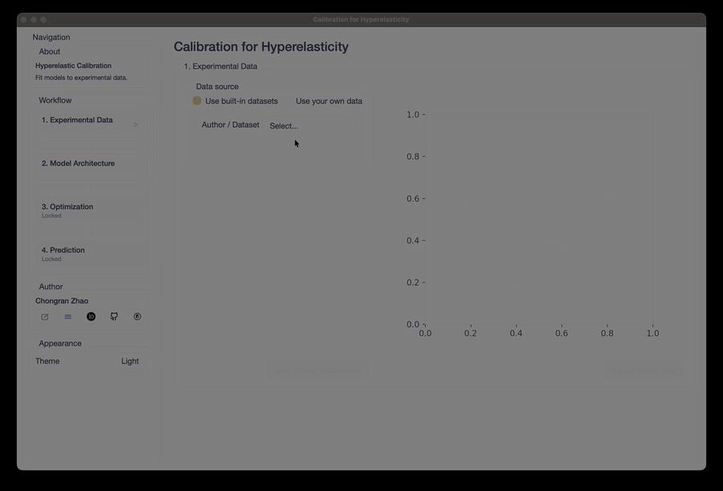

# Hyperelastic Material Calibration

Core Python routines for fitting hyperelastic material models to experimental
data and running prediction workflows.

The previous Streamlit and PySide desktop interfaces have been removed while a
new web UI is being prepared. The current repository is intentionally focused on
the computational layer, packaged datasets, and the new web workbench.

## Install

```bash
git clone https://github.com/Chongran-Zhao/Calibration-Hyperelasticity.git
cd Calibration-Hyperelasticity
pip install -r requirements.txt
```

Install frontend dependencies:

```bash
cd frontend
npm install
```

## Run Locally

Start the Python API:

```bash
uvicorn backend.main:app --reload
```

In another terminal, start the web UI:

```bash
cd frontend
npm run dev
```

Open the URL shown by Vite, usually:

```text
http://localhost:5173
```

## Project Structure

- `src/`: material models, kinematics, optimization, plotting, and utilities.
- `backend/`: FastAPI bridge for datasets and preview data.
- `frontend/`: React/Tailwind web interface.
- `data/data.h5`: packaged experimental datasets.
- `assets/examples/`: example screenshots and animations.
- `DESIGN.md`: design direction for the upcoming web interface.

## Example: Zhan (Non-Gaussian)

This example reproduces Fig. 7 from Zhan (JMPS) by fitting the Zhan
(non-Gaussian) model to James 1975 uniaxial tension data, then predicting
biaxial tension.


