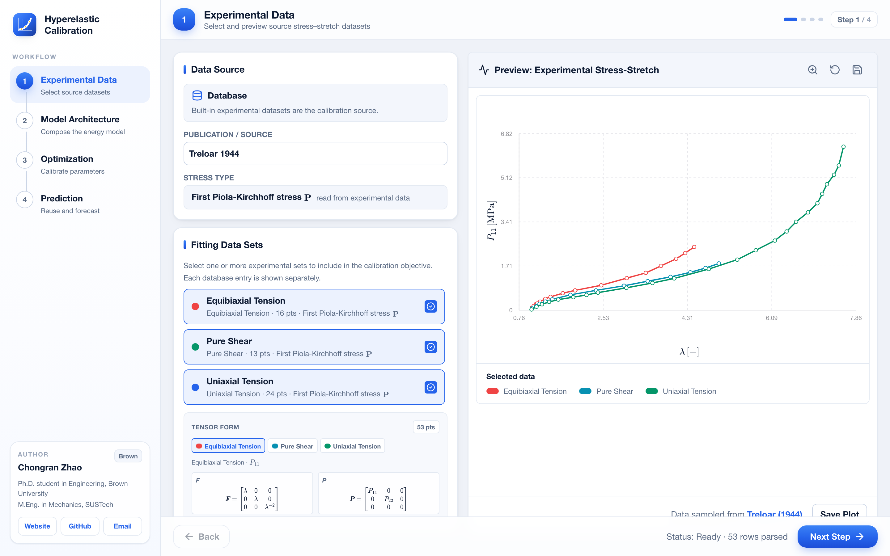

<div align="center">


# Calibration for Hyperelasticity

**A desktop &amp; web workbench for fitting hyperelastic material models to experimental stress–stretch data — and predicting new loading modes.**

[](https://www.python.org/)
[](https://react.dev/)
[](https://fastapi.tiangolo.com/)
[](https://github.com/Chongran-Zhao/Calibration-Hyperelasticity/releases)
[](#license)
[](#install)

</div>

<div align="center">
  
</div>

---

## Overview

**Calibration for Hyperelasticity** turns a pile of experimental stress–stretch
curves into calibrated constitutive models. Pick a dataset, compose a
strain-energy model (single or a parallel network of springs), run the
optimizer, and reuse the fitted parameters to predict loading modes you never
measured — all through a guided four-step workflow.

The computational core is the **`hyperfit`** Python package. The interface is a
React frontend served by FastAPI, running either **inside a native desktop
window** or in the browser. The two share one codebase and one server.

```
Experimental Data  →  Model Architecture  →  Optimization  →  Prediction
```

## Highlights

- **Guided workflow** — a four-step pipeline from raw data to prediction, with a
  numbered progress rail so you always know where you are.
- **Rich model library** — Neo-Hookean, Mooney–Rivlin, Yeoh, Arruda–Boyce,
  Ogden (*n*-term), the Zhan Gaussian / non-Gaussian micromechanical models,
  and a configurable Hill family over five generalized strain measures.
- **Parallel networks** — compose models as isostrain springs; parameters are
  namespaced and fit jointly.
- **Vectorized core** — stress evaluation runs on batched NumPy, giving a
  median **~7× speedup** on objective evaluations (up to 150× on large sets)
  versus the original implementation.
- **8 built-in datasets** — 55 loading configurations across rubber, elastomer,
  gel and brain-tissue experiments, packaged in a single HDF5 file.
- **Reproducible** — a numerical regression suite pins every model's stress
  tensors, objective values and full calibrations to a recorded baseline.

## Install

```bash
brew install --cask Chongran-Zhao/hyperfit/hyperelastic-calibration   # install
brew upgrade  --cask hyperelastic-calibration                        # update
```

Homebrew installs the prebuilt app in `/Applications`; it does not install
Python, Node.js, or build tools. All calculations and saved workspaces stay on
the Mac. The app binds its API to `127.0.0.1` only.

## Build from Source

Requirements: Python 3.9 or newer, Node.js 18 or newer, and npm.

```bash
git clone https://github.com/Chongran-Zhao/Calibration-Hyperelasticity.git
cd Calibration-Hyperelasticity

python3 -m venv .venv
source .venv/bin/activate
python -m pip install --upgrade pip
python -m pip install -e ".[desktop,plot,cli,dev]"

npm --prefix frontend ci
npm --prefix frontend run build
python -m hyperfit.desktop
```

The editable install also provides the `hyperfit-app` command. The launcher
starts FastAPI on a free local port and opens the React workbench in a native
pywebview window. Useful variants:

```bash
hyperfit-app --browser   # open the workbench in the default browser
hyperfit-app --check     # run the headless desktop-app smoke test
```

> **macOS + system Python 3.9:** the native window needs `pywebview`, which
> pulls in `pyobjc`. On 3.9 the requirements pin `pyobjc<12` (newer releases
> ship wheels only for 3.10+). `--browser` mode has no such dependency.

## Local Workspace

Sessions, imported datasets, and user-defined models are stored outside the
application bundle so that upgrades do not overwrite them:

```text
~/.hyperfit/
├── sessions/
├── datasets/
└── models/
```

Removing the app does not remove this directory. Delete it separately only
when you also want to erase all local workspaces and custom content.

## Development

For hot-reloading UI work, run the API and the vite dev server separately:

```bash
uvicorn backend.main:app --reload       # API on :8000
npm --prefix frontend run dev           # UI on :5173, /api proxied to :8000
```

After changing the frontend, rebuild the production assets with
`npm --prefix frontend run build` before launching the desktop app.

## Model Library

| Model | Type | Parameters |
| --- | --- | --- |
| Neo-Hookean | Invariant | `C₁` |
| Mooney–Rivlin | Invariant | `C₁, C₂` |
| Yeoh | Invariant | `C₁, C₂, C₃` |
| Arruda–Boyce | Invariant (micromechanical) | `μ, N` |
| Ogden (*n*-term) | Stretch | `μᵢ, αᵢ` |
| Modified Ogden | Stretch | `μ, α` |
| Hill (5 strain measures) | Stretch | `μ, mᵢ, nᵢ` |
| Zhan Gaussian | Closed-form PK1 | `μ` |
| Zhan non-Gaussian | Closed-form PK1 (Lebedev) | `μ, N` |

Any subset can be combined into a **parallel network**. Generalized strains for
the Hill family: Seth–Hill, Hencky, Curnier–Rakotomanana, Curnier–Zysset,
Darijani–Naghdabadi.

## Datasets

Eight experimental sources ship in `data/data.h5` (55 loading configurations):

| Source | Material |
| --- | --- |
| Treloar (1944) | Vulcanized rubber |
| James, Green &amp; Simpson (1975) | Rubber |
| Jones &amp; Treloar (1975) | Rubber, biaxial |
| Kawabata et al. (1981) | Rubber, biaxial |
| Kawamura et al. (2001) | Elastomer |
| Katashima et al. (2012) | Polymer gel |
| Meunier et al. (2008) | Silicone rubber |
| Budday et al. (2017) | Human brain tissue |

Supported loading modes: uniaxial tension/compression (UT/UC), equibiaxial
tension (ET), pure shear (PS), simple &amp; compound simple shear (SS/CSS),
biaxial tension (BT).

## Project Structure

```
hyperfit/                 the calibration core (Python package)
├── models.py             model registry + Ogden / Hill factories
├── strains.py            generalized strain measures
├── zhan.py               Zhan closed-form-stress models (scalar + batch)
├── kinematics.py         PK1/PK2/Cauchy stress (scalar + vectorized batch)
├── mechanics.py          loading-mode geometry, inverse Langevin
├── evaluation.py         single source of truth: tensors → observables
├── datasets.py           HDF5 / text experimental-data loading
├── optimizer.py          R²-normalized calibration on SciPy solvers
├── network.py            parallel (isostrain) model composition
├── plotting.py           matplotlib comparison plots
├── desktop.py            desktop launcher (uvicorn + pywebview)
└── api/                  FastAPI layer (routes · metadata · services)

backend/main.py           compatibility shim exposing hyperfit.api
frontend/                 React / Tailwind web interface (vite)
data/data.h5              packaged experimental datasets
tests/                    numerical regression suite + baseline
```

## Testing

```bash
python3 tests/test_regression.py
python3 -m hyperfit.desktop --check
```

Recomputes stress tensors, objective values and full calibrations for every
model family against `tests/baseline.json` and fails on numerical drift.

## macOS Distribution

Version tags build an Apple Silicon DMG, publish it to GitHub Releases, and
sync its SHA-256-pinned cask to `Chongran-Zhao/homebrew-hyperfit`. Maintainer
instructions are in [docs/releasing.md](docs/releasing.md).

## Author

**Chongran Zhao** — Ph.D. student in Engineering, Brown University · M.Eng. in
Mechanics, SUSTech.
[Website](https://chongran-zhao.github.io) ·
[GitHub](https://github.com/Chongran-Zhao) ·
[Email](mailto:chongran_zhao@brown.edu)

## License

Released under the MIT License.
