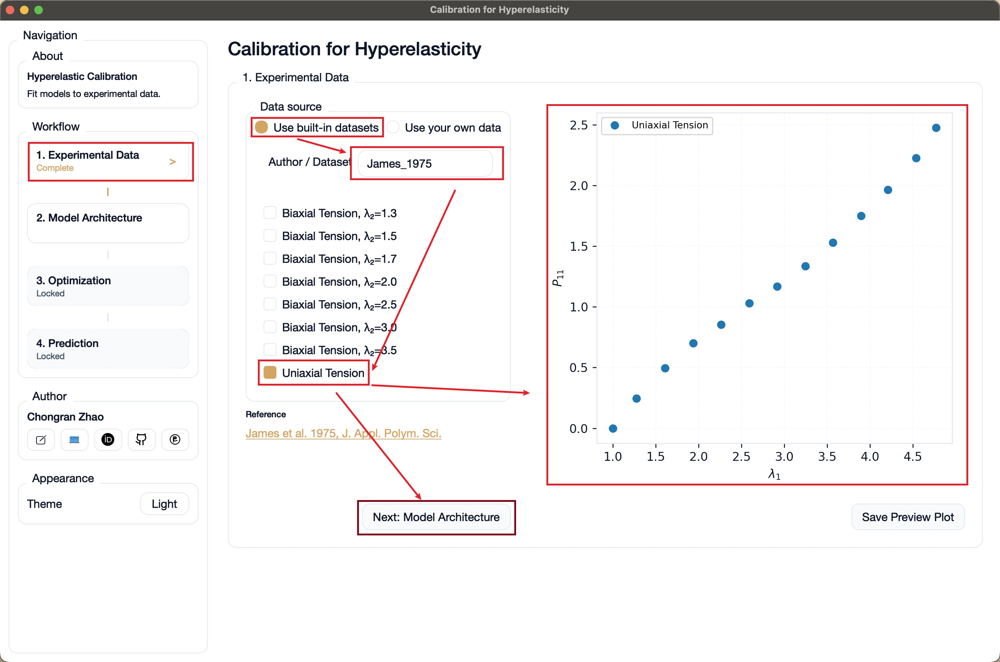
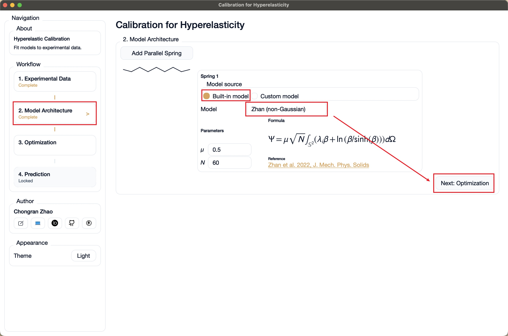
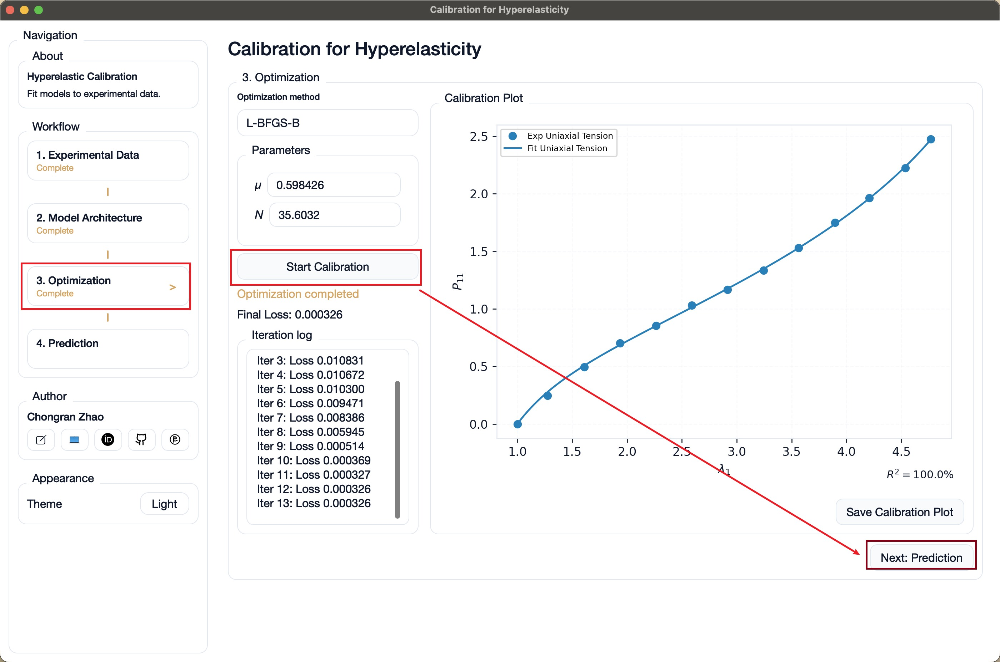
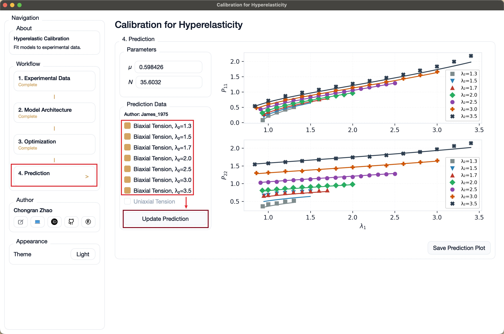

# Hyperelastic Material Calibration

## Two ways to use

### 1) Install the macOS app (recommended)

Install via Homebrew and launch it like a normal app from Launchpad:

```
brew install --cask Chongran-Zhao/hyperelastic/hyperelastic-calibration
```

Update the app:

```
brew update && brew upgrade --cask hyperelastic-calibration
```

### 2) Run from source

Clone this repo, install dependencies, and launch from Terminal:

```
git clone https://github.com/Chongran-Zhao/Calibration-Hyperelasticity.git
cd Calibration-Hyperelasticity
```

1) Install dependencies:
```
pip install -r requirement.txt
```

2) Run the GUI:
```
python qt_app.py
```

## User Guide

1) Select experimental data (built-in or your own).
2) Configure the material model.
3) Run calibration.
4) Run prediction on selected datasets.

## Example: Zhan (non-Gaussian)

Note: The figures in this README are not updated yet in the GitHub preview.

This example reproduces Fig. 7 from Zhan (JMPS) by fitting the Zhan (non-Gaussian)
model to James 1975 uniaxial tension data, then predicting biaxial tension.

Step 1: Select the experimental data.


Step 2: Configure the material model.


Step 3: Run calibration.


Step 4: Run prediction.

